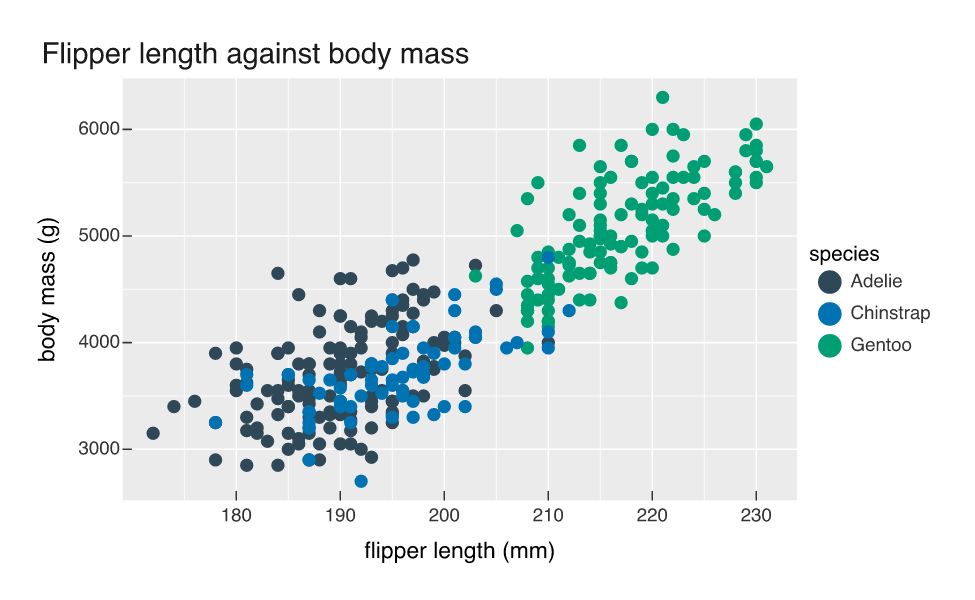

```{r}
#| include: false
source("_helper.R")
dir.create("figs", showWarnings = FALSE)
```

Ask a language model for a plot and you normally get R code, which you then have to
run. Executing generated code is the part nobody wants to defend, and the failure
mode is bad: the model invents a column name, the script throws, and you get a
traceback written for a human debugging their own typo.

Because a vellumplot plot [is a spec](spec-as-data.qmd), the model can produce the
*document* instead. Nothing is executed. Three functions cover the loop: one to tell
the model what the data actually contains, one to check what came back, and one to
serve both over the Model Context Protocol.

## Telling the model what the columns are

`spec_fields()` is the grounding step. One row per column, with the encoding type a
spec would use, how many distinct values it has, and a few real ones:

```{r}
peng <- na.omit(datasets::penguins)
spec_fields(peng)
```

Hallucinated field names mostly come from the model guessing at a schema it was never
shown. Hand it this table first and the guessing stops.

## Compiling what it wrote

A spec is JSON, so this is the whole payload for a coloured scatter:

```{r}
spec <- '{
  "version": "1",
  "width": 6.5, "height": 4, "dpi": 150,
  "data": {"name": "penguins"},
  "layers": [
    {"mark": "point",
     "encoding": {
       "x": {"field": "flipper_len", "type": "quantitative"},
       "y": {"field": "body_mass", "type": "quantitative"},
       "color": {"field": "species", "type": "nominal"}}}
  ],
  "labels": {"title": "Flipper length against body mass",
             "x": "flipper length (mm)", "y": "body mass (g)",
             "color": "species"}
}'

p <- vplot_from_spec(spec, data = peng)
```

```{r}
#| echo: false
vg(p, "agent-specs")
```

`vplot_from_spec()` validates every referenced field against the data and dry-runs the
compile before handing back a `PlotSpec`. Get a name wrong and the error is a record
rather than a stack trace: which field, what was expected, what exists.

```{r}
#| error: true
vplot_from_spec(sub("flipper_len", "flipper_length", spec, fixed = TRUE), data = peng)
```

`spec_diagnose()` is the same check without the throw, for a caller that would rather
branch on `$ok` and retry.

## Over MCP

`mcp_serve()` puts that behind three tools: `get_schema`, `list_fields`, and
`render_spec`. It speaks newline-delimited JSON-RPC 2.0 on stdio, in pure R, so
registering it takes one line:

```sh
claude mcp add vellumplot -- Rscript -e 'vellumplot::mcp_serve()'
```

Nothing about it is specific to a client, and the protocol is plain enough to speak by
hand. Start one server, hand it a handshake and three tool calls on stdin, and read the
replies back off stdout:

```{r}
csv <- file.path(tempdir(), "penguins.csv")
write.csv(peng, csv, row.names = FALSE)

req <- function(id, method, params = list()) {
  jsonlite::toJSON(list(jsonrpc = "2.0", id = id, method = method, params = params),
                   auto_unbox = TRUE)
}
call <- function(id, name, arguments) {
  req(id, "tools/call", list(name = name, arguments = arguments))
}

session <- c(
  req(1, "initialize"),
  req(2, "tools/list"),
  call(3, "list_fields", list(data_path = csv)),
  call(4, "render_spec", list(spec = spec, data_path = csv,
                              out_path = "figs/agent-specs-mcp.png")),
  call(5, "render_spec", list(spec = sub("body_mass", "mass", spec, fixed = TRUE),
                              data_path = csv))
)

out <- system2("Rscript", c("-e", shQuote("vellumplot::mcp_serve()")),
               input = session, stdout = TRUE)
replies <- lapply(out, jsonlite::fromJSON, simplifyVector = FALSE)

length(replies)
replies[[1]]$result$serverInfo
vapply(replies[[2]]$result$tools, `[[`, character(1), "name")
```

Five requests, five replies, one process. Request 3 is `list_fields`, which hands back
the same table `spec_fields()` printed above, this time as JSON. Request 4 renders, and
reports where it put the file:

```{r}
cat(replies[[4]]$result$content[[1]]$text)
```

```{r}
#| echo: false

```

That figure came out of the server, not out of this page. The agent never saw R code
and the host never ran any. The fifth request is the same spec with one field renamed,
and it comes back the same shape as the error above, flagged as a tool error so the
client knows to repair rather than report:

```{r}
replies[[5]]$result$isError
cat(replies[[5]]$result$content[[1]]$text)
```

That `hint` is what turns a retry into a fix instead of another guess.

## Which rows drew this element

The other half of an agent's problem is reading a figure back. `provenance_join()`
compiles the plot once and returns one row per drawn element, carrying both the source
rows that produced it and where it landed in device pixels:

```{r}
pj <- provenance_join(p)
pj[, c("id", "layer", "mark", "x", "y", "w", "h", "n_rows")]
```

The scatter draws as three grobs, one per species, so each row here covers a whole
group and its bounding box. `rows` is a list column of indices back into the data:

```{r}
head(peng[pj$rows[[3]], c("species", "flipper_len", "body_mass")], 4)
```

Given a pixel, the boxes say which element was hit and the indices say what it means,
which is the substrate under linked views and click-to-source. It is also how a figure
gets audited, since every element can name the data behind it. The hashing side of the
same idea is in
[A figure that carries its own provenance](provenance.qmd).
