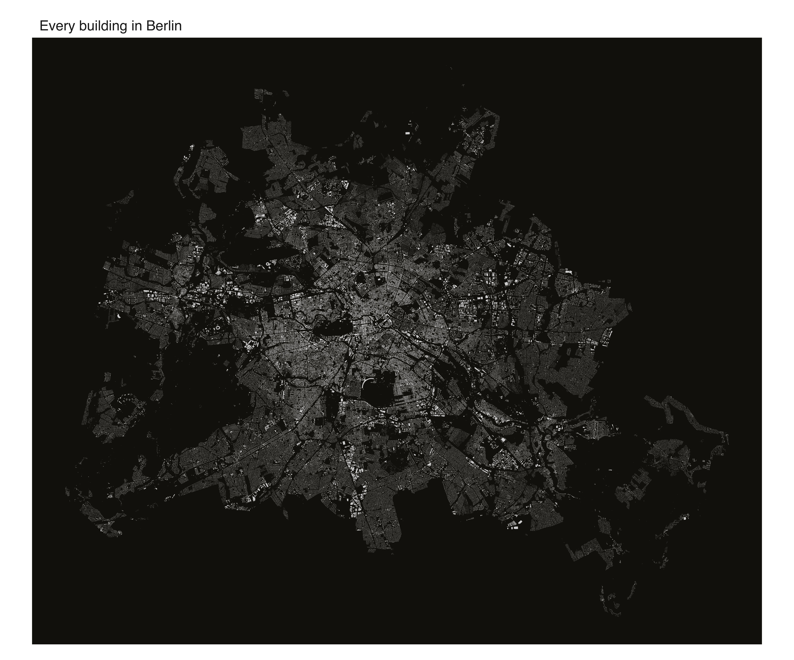

No streets are drawn here, and no labels. Every pale shape is one building
footprint; the black between them is everything else, mostly roads. At 536,700
buildings the city draws itself: the radial arms reaching out from the centre,
Tempelhofer Feld as the clean void in the south (the old airport), the Grunewald
forest biting into the west, and the lakes and the Spree cutting dark channels
through the fabric.

::: {.callout-note}
This example is **not run** when the site is built. It reads a ~94 MB `.osm.pbf`
from disk and needs the `sf` package. The image below is the real output,
committed with the site; the script at the end is the exact source. The extract
is Geofabrik's [Berlin download](https://download.geofabrik.de/europe/germany/berlin.html).
:::

## From tags to polygons

The node-density showcases elsewhere in this gallery only ever plot points. A
building is different: it is a *way* (a closed ring of node references) or a
*multipolygon relation*, so its geometry has to be assembled before anything can
be filled. GDAL's OSM driver does that assembly and exposes the result as a
`multipolygons` layer, which `sf` reads directly. Keeping the rows tagged
`building` leaves 536,700 polygons.

Drawing that many filled polygons is the load-bearing part. `mark_sf()` renders
the whole set in one pass, so the footprints come out as true shapes: a corner
block, a supermarket, an airport hangar each keep their own size and outline
rather than collapsing to a dot.

## The map

{fig-alt="Figure-ground map of all 536,700 building footprints in Berlin in pale tones on a dark ground, streets appearing as the gaps"}

Rendered at 6600 px, so it rewards zooming: the Altbau blocks show their inner
courtyards, the villa districts on the edges thin to loose scatter, and the
post-war estates read as their own coarse-grained texture against the fine grid
of the nineteenth-century core.

## The script

```r
# Every building in Berlin, as a figure-ground map.
#
# Reads all building polygons from the .osm.pbf through GDAL's OSM driver -- the
# `multipolygons` layer assembles closed ways and multipolygon relations into
# geometry -- and draws the footprints with mark_sf().
#
# REQUIREMENTS (none are vellumplot dependencies -- this is a heavy showcase):
#   * package `sf`
#   * a Berlin .osm.pbf from
#     https://download.geofabrik.de/europe/germany/berlin.html

library(sf)
library(vellumplot)

pbf <- path.expand("~/Downloads/berlin-latest.osm.pbf")

# GDAL assembles the multipolygons layer; keep every building's geometry.
b <- st_read(
  pbf,
  query = "SELECT osm_id FROM multipolygons WHERE building IS NOT NULL",
  quiet = TRUE
)["geometry"]
message(format(nrow(b), big.mark = ","), " buildings")

# Frame to the data's own aspect (latitude-corrected) so nothing is stretched.
bb <- st_bbox(b)
asp <- (bb["ymax"] - bb["ymin"]) /
  ((bb["xmax"] - bb["xmin"]) * cos(mean(c(bb["ymin"], bb["ymax"])) * pi / 180))

# Single warm fill on a dark ground; the unfilled space is the street network.
# High dpi so the small footprints stay crisp when zoomed.
vplot(b, width = 11, height = 11 * asp, dpi = 600) |>
  mark_sf(fill = "#e8cf9f", color = NA) |>
  coord_sf() |>
  theme_void() |>
  set_theme(panel_bg = "#12100c") |>
  labs(title = "Every building in Berlin") |>
  render_plot("berlin-buildings.png")
```
