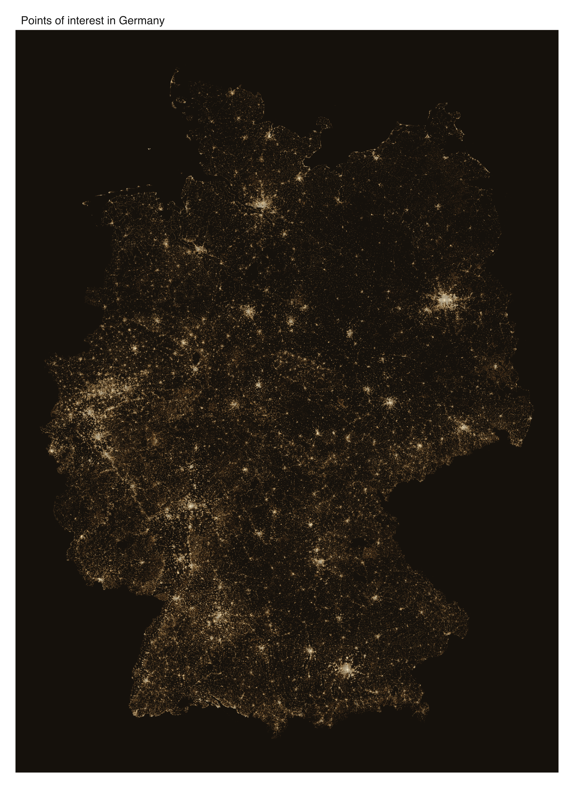
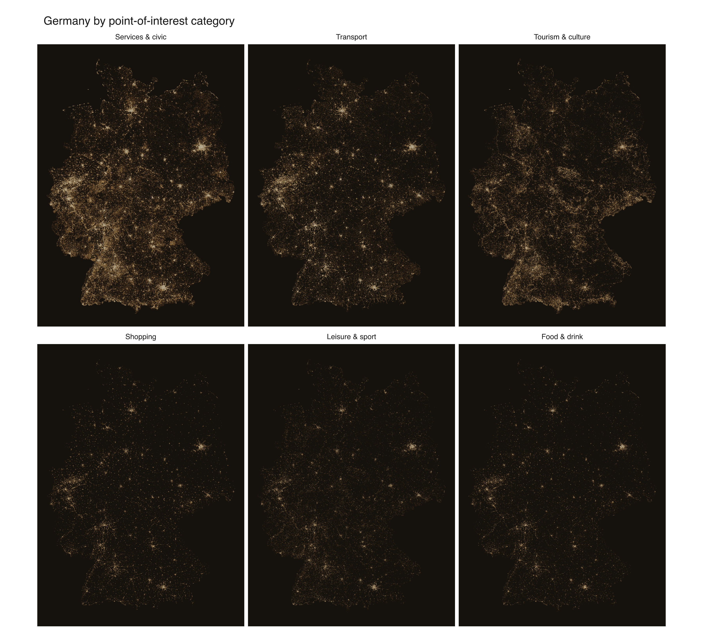
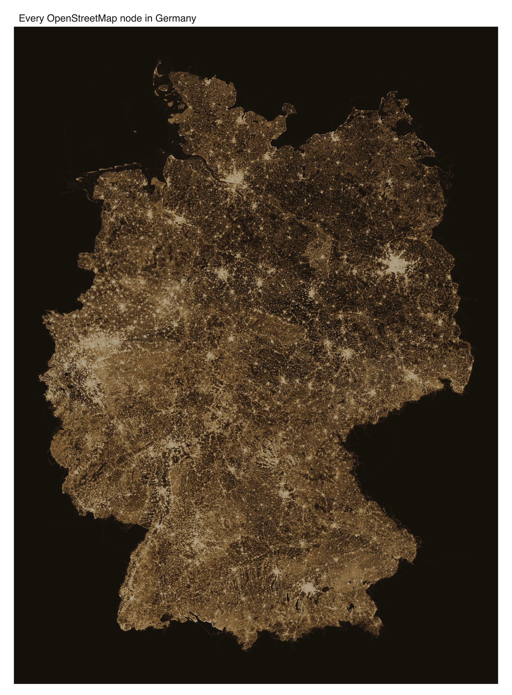

OpenStreetMap holds Germany at two densities. About four million of its nodes
carry a tag you might search for: a bakery, a tram stop, a car park. The other
several hundred million are untagged, there only to trace the shape of a road,
a river, a building outline. Both sit in the same `.osm.pbf`, and this page
datashades each of them in warm earth tones.

::: {.callout-note}
This example is **not run** when the site is built. It reads a ~4 GB `.osm.pbf`
from disk and needs the `duckdb` and `DBI` packages. The images below are the
real output, committed with the site; the script at the end is the exact
source. The extract is Geofabrik's
[Germany download](https://download.geofabrik.de/europe/germany.html).
:::

## The tagged places

Keeping only the nodes tagged `amenity`, `shop`, `tourism`, `leisure` or
`public_transport` leaves 4.3 million points, each sorted into one of six
categories on its way out of DuckDB. Shaded by density they already draw the
country: the Ruhr as a bright smear on the west, Berlin, Hamburg, Munich,
Frankfurt and Stuttgart as glowing cores, the rural east visibly thinner.

{fig-alt="Datashaded density map of 4.3 million OpenStreetMap points of interest across Germany in earth tones, cities bright on a dark ground"}

Faceting by category gives each type its own equalisation, so the small ones
stay readable next to the big. Services and civic furniture, the benches and
bins and post boxes, is both the largest slice (two million of the 4.3 million)
and the most evenly spread. Food, shopping and leisure pull back to the cities.

{fig-alt="Six small-multiple datashaded maps of Germany, one per POI category, each showing a distinct spatial pattern"}

## Every node

Drop the tag filter and 4.3 million becomes 436 million. Almost all of the extra
is untagged geometry: the vertices of every street, field boundary and
coastline, down to the ragged edges of Sylt and Rügen. That many points will not
pass through an in-memory plotting pipeline on this machine, and the limit is
the machine's RAM, not the plotting library.

| | count |
|---|--:|
| nodes in the frame | 436,379,125 |
| non-empty grid cells | 11,347,904 |

The fix is to aggregate before R sees anything. DuckDB snaps each node to a cell
of the output grid, counts, and returns only the cells that hold something. 436
million points become 11 million cells, a 38× cut, and the image does not
change: binning to the render grid is what datashading does anyway, wherever it
runs. R colours the 11 million cells and `mark_tile()` draws them. The
[South America example](south-america-nodes.qmd) works through why this is
lossless.

{fig-alt="Datashaded map of all 436 million OpenStreetMap nodes in Germany, tracing roads, rivers and settlements in earth tones"}

## The script

```r
# OpenStreetMap Germany, two ways: tagged POIs and every node.
#
# Streams a germany .osm.pbf with DuckDB's spatial extension and renders three
# figures on an earthy palette: a POI density map, POIs faceted by category, and
# every node aggregated to a pixel grid IN DUCKDB, so 436M points fit in memory.
#
# REQUIREMENTS (none are vellumplot dependencies -- this is a heavy showcase):
#   * packages `duckdb`, `DBI`
#   * a Germany .osm.pbf from https://download.geofabrik.de/europe/germany.html

library(DBI)
library(duckdb)
library(vellumplot)

pbf <- path.expand("~/Downloads/germany-latest.osm.pbf")
outdir <- "figures"
dir.create(outdir, showWarnings = FALSE)

# Warm earth ramp, empty -> dense; the first stop doubles as the panel bg.
ramp <- c("#15110c", "#432a16", "#8a5a2b", "#c8974a", "#efe0be")

# Mainland frame. The extract carries a few stray out-of-area nodes that would
# otherwise blow the bounding box out and leave the country tiny in black.
crop <- list(lon = c(5.8, 15.1), lat = c(47.2, 55.1))
mx <- crop$lon * 20037508.34 / 180
my <- log(tan((90 + crop$lat) * pi / 360)) / (pi / 180) * 20037508.34 / 180
where <- sprintf(
  "WHERE x BETWEEN %.10g AND %.10g AND y BETWEEN %.10g AND %.10g",
  mx[1], mx[2], my[1], my[2]
)

proj_xy <- "
  lon * 20037508.34 / 180.0 AS x,
  ln(tan((90.0 + least(85.05, greatest(-85.05, lat))) * pi() / 360.0))
    / (pi() / 180.0) * 20037508.34 / 180.0 AS y"

category_case <- "
  CASE
    WHEN tags['amenity'] IN ('restaurant','cafe','bar','pub','fast_food',
         'biergarten','food_court','ice_cream') THEN 'Food & drink'
    WHEN tags['shop'] IS NOT NULL THEN 'Shopping'
    WHEN tags['tourism'] IS NOT NULL
         OR tags['amenity'] IN ('theatre','cinema','arts_centre','nightclub')
         THEN 'Tourism & culture'
    WHEN tags['public_transport'] IS NOT NULL
         OR tags['amenity'] IN ('parking','bicycle_parking','fuel',
         'charging_station','bicycle_rental','car_sharing','taxi',
         'bus_station','parking_entrance') THEN 'Transport'
    WHEN tags['leisure'] IS NOT NULL
         OR tags['amenity'] = 'fitness_centre' THEN 'Leisure & sport'
    ELSE 'Services & civic'
  END"

# --- 1. Extract each layer -> Parquet (once) -------------------------------
# ST_ReadOSM() streams the PBF; the SELECT/WHERE and Web Mercator projection run
# in SQL, so only the final rows leave DuckDB.
extract <- function(layer) {
  pq <- file.path(outdir, sprintf("germany-%s.parquet", layer))
  if (file.exists(pq)) return(pq)
  sel <- if (layer == "poi") {
    paste0(proj_xy, ",\n  ", category_case, " AS category")
  } else {
    proj_xy
  }
  filt <- if (layer == "poi") {
    "AND (tags['amenity'] IS NOT NULL OR tags['shop'] IS NOT NULL
          OR tags['tourism'] IS NOT NULL OR tags['leisure'] IS NOT NULL
          OR tags['public_transport'] IS NOT NULL)"
  } else {
    ""
  }
  con <- dbConnect(duckdb())
  dbExecute(con, "INSTALL spatial; LOAD spatial;")
  dbExecute(con, "SET threads TO 4; SET memory_limit = '12GB';")
  dbExecute(con, sprintf(
    "COPY (SELECT %s FROM ST_ReadOSM('%s')
           WHERE kind = 'node' %s AND lat IS NOT NULL AND lon IS NOT NULL)
     TO '%s' (FORMAT parquet, COMPRESSION zstd)",
    sel, pbf, filt, pq
  ))
  dbDisconnect(con, shutdown = TRUE)
  pq
}

# --- 2. Grid + colour helpers ----------------------------------------------
# 2D histogram in SQL: snap to a cell, GROUP BY, COUNT. Returns non-empty cells.
# The parentheses around every %.10g matter once bounds can be negative:
# "x - -1.5e7" would splice into "x --1.5e7", where SQL's "--" starts a comment.
shade_grid <- function(con, pq, w, by_cat = FALSE) {
  b <- dbGetQuery(con, sprintf(
    "SELECT min(x) x0, max(x) x1, min(y) y0, max(y) y1
     FROM read_parquet('%s') %s", pq, where
  ))
  asp <- (b$y1 - b$y0) / (b$x1 - b$x0)
  h <- as.integer(w * asp)
  extra <- if (by_cat) ", category" else ""
  g <- dbGetQuery(con, sprintf(
    "SELECT
       least(%d, greatest(0, floor((x - (%.10g)) / ((%.10g) - (%.10g)) * %d)::INT)) AS cx,
       least(%d, greatest(0, floor((y - (%.10g)) / ((%.10g) - (%.10g)) * %d)::INT)) AS cy%s,
       count(*) AS n
     FROM read_parquet('%s') %s
     GROUP BY 1, 2%s",
    w - 1L, b$x0, b$x1, b$x0, w,
    h - 1L, b$y0, b$y1, b$y0, h, extra, pq, where, extra
  ))
  list(grid = g, asp = asp)
}

# eq_hist (rank/CDF) mapped through the earthy ramp; `by` equalises per group.
colours <- function(n, by = NULL) {
  eq <- if (is.null(by)) {
    rank(n, ties.method = "average") / length(n)
  } else {
    ave(n, by, FUN = function(z) rank(z, ties.method = "average") / length(z))
  }
  grDevices::rgb(grDevices::colorRamp(ramp)(eq), maxColorValue = 255)
}

# --- 3. Render -------------------------------------------------------------
poi_pq <- extract("poi")
nodes_pq <- extract("nodes")
con <- dbConnect(duckdb())
dbExecute(con, "SET threads TO 4; SET memory_limit = '12GB';")

density_map <- function(pq, w, title, out) {
  sg <- shade_grid(con, pq, w)
  sg$grid$fill <- colours(sg$grid$n)
  vplot(sg$grid, width = 10, height = 10 * sg$asp, dpi = 300) |>
    mark_tile(x = cx, y = cy, fill = fill) |>
    scale_fill_identity() |>
    coord_fixed() |>
    theme_void() |>
    set_theme(panel_bg = ramp[1]) |>
    labs(title = title) |>
    render_plot(file.path(outdir, out))
}

# (a) POI density
density_map(poi_pq, 2500L, "Points of interest in Germany", "germany-poi-density.png")

# (b) POI faceted by category (each panel its own eq_hist)
sg <- shade_grid(con, poi_pq, 1200L, by_cat = TRUE)
cg <- sg$grid
cg$fill <- colours(cg$n, by = cg$category)
cg$category <- factor(cg$category, levels = c(
  "Services & civic", "Transport", "Tourism & culture",
  "Shopping", "Leisure & sport", "Food & drink"
))
vplot(cg, width = 12, height = 12 * sg$asp / 3 * 2, dpi = 300) |>
  mark_tile(x = cx, y = cy, fill = fill) |>
  scale_fill_identity() |>
  facet_wrap(~category) |>
  coord_fixed() |>
  theme_void() |>
  set_theme(panel_bg = ramp[1]) |>
  labs(title = "Germany by point-of-interest category") |>
  render_plot(file.path(outdir, "germany-poi-category.png"))

# (c) Every node -- aggregated in DuckDB, so 436M points fit in memory
density_map(nodes_pq, 4000L, "Every OpenStreetMap node in Germany", "germany-nodes-density.png")

dbDisconnect(con, shutdown = TRUE)
```
