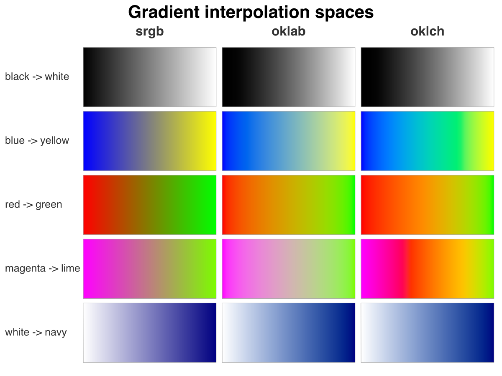

```{r}
#| include: false
suppressMessages(library(vellum))
```

A gradient between two colours has to decide what sits in the middle. vellum lets
you pick the colour space where that blend happens, through the `interpolation`
argument on `linear_gradient()` and `radial_gradient()`.

`"srgb"` is the default and what most graphics backends do: a straight line in
gamma-encoded sRGB. It is fast, but a ramp between two vivid colours dips through
dark, muddy midtones. `"oklab"` walks a straight line through the perceptually
uniform Oklab space, so lightness climbs evenly and the muddy dip disappears;
near-complementary pairs still wash out toward grey in the centre, because the
straight path passes close to the neutral axis. `"oklch"` moves through the polar
form of the same space, letting hue and chroma travel on their own arcs, so the
ramp stays saturated across the middle and sweeps through the intervening hues
(blue to yellow goes by way of green).

The grid below runs five colour pairs through all three modes. The black-to-white
row is a control: with no hue in play, only the lightness curve differs.

```{r}
#| code-fold: true
#| code-summary: "Show the scene code"
modes <- c("srgb", "oklab", "oklch")

pairs <- list(
  list(name = "black -> white",  cols = c("black", "white")),
  list(name = "blue -> yellow",  cols = c("blue", "yellow")),
  list(name = "red -> green",    cols = c("red", "green")),
  list(name = "magenta -> lime", cols = c("magenta", "#7CFC00")),
  list(name = "white -> navy",   cols = c("white", "navy"))
)

nrow <- length(pairs)
ncol <- length(modes)

# Layout in scene npc: a label column, a title band, then a grid of swatches.
label_w <- 0.15
x0 <- label_w + 0.01
x1 <- 0.99
top <- 0.88
bot <- 0.03
colw <- (x1 - x0) / ncol
rowh <- (top - bot) / nrow
pad <- 0.006

s <- vl_scene(width = 8, height = 6, dpi = 150, bg = "white")

s <- draw(s, text_grob("Gradient interpolation spaces", x = 0.5, y = 0.965,
  gp = vl_gpar(col = "black", fontface = "bold", fontsize = 20)))
for (j in seq_len(ncol)) {
  cx <- x0 + (j - 0.5) * colw
  s <- draw(s, text_grob(modes[[j]], x = cx, y = 0.915,
    gp = vl_gpar(col = "grey20", fontface = "bold", fontsize = 15)))
}

# One swatch per (pair, mode): a rect filled with a left-to-right gradient
# spanning the swatch's own viewport.
for (i in seq_len(nrow)) {
  p <- pairs[[i]]
  yc <- top - (i - 0.5) * rowh
  s <- draw(s, text_grob(p$name, x = 0.01, y = yc, just = c("left", "centre"),
    gp = vl_gpar(col = "grey20", fontsize = 12)))
  for (j in seq_len(ncol)) {
    cx <- x0 + (j - 0.5) * colw
    vp <- vl_viewport(x = cx, y = yc, width = colw - 2 * pad, height = rowh - 2 * pad)
    grad <- linear_gradient(p$cols, x1 = 0, y1 = 0.5, x2 = 1, y2 = 0.5,
      interpolation = modes[[j]])
    s <- s |>
      push(vp) |>
      draw(rect_grob(gp = vl_gpar(col = "grey60", lwd = 0.5, fill = grad))) |>
      pop()
  }
}
```

```{r}
#| include: false
dir.create("figs", showWarnings = FALSE)
render(s, file.path("figs", "gradient-interpolation.png"))
```

{fig-alt="A grid of gradient swatches: five colour pairs down the rows, the srgb, oklab and oklch interpolation modes across the columns. sRGB ramps darken through the middle, oklab keeps even lightness but greys out near-complementary pairs, oklch holds chroma across the middle."}

Read the vivid rows across and the trade-off is clear. sRGB darkens; Oklab keeps
the lightness honest but drains colour from the centre; Oklch holds the chroma
and pays for it by touring the hues in between. The perceptual modes are
pre-sampled into dense sRGB stops inside the Rust core, so the raster, SVG, and
PDF backends all produce the same ramp. This is the backend that
[vellumplot](https://r-vellum.github.io/vellumplot/) draws on for its fills and
scales.
