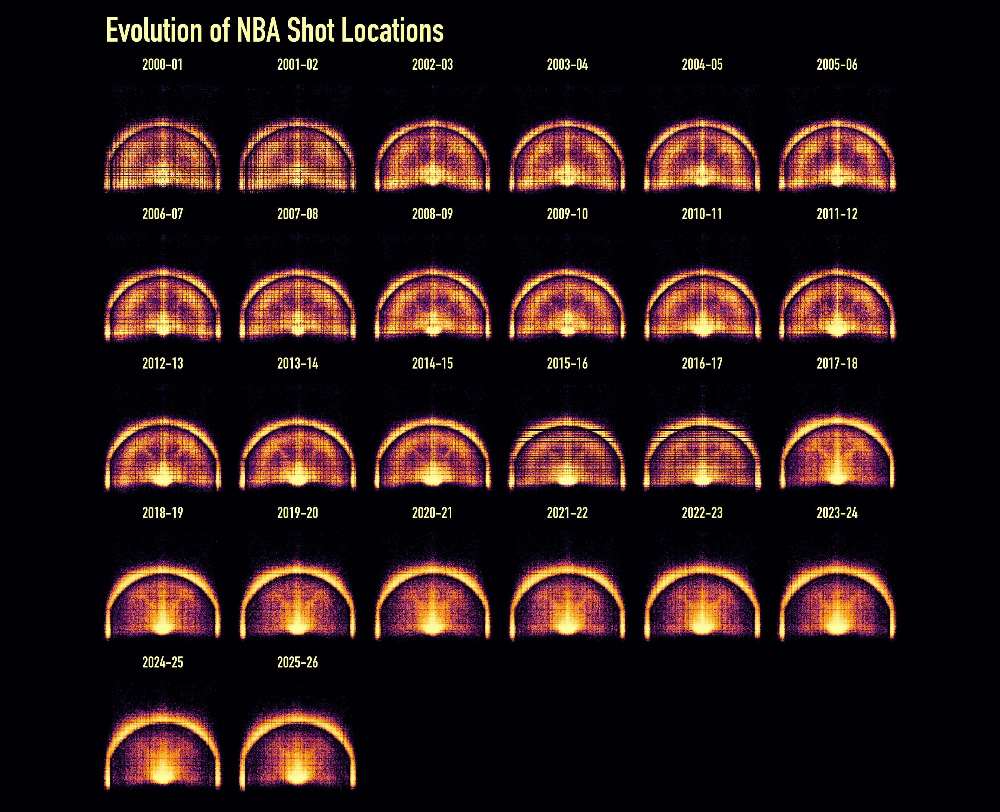

Every field-goal attempt in the NBA records where it was taken: how far left or
right of the basket, and how far out. Pool 26 seasons, give each its own panel,
and the change in where teams shoot is plain. In 2000–01 the whole floor is lit,
the mid-range as bright as anything. Over the next two decades the middle band
cools to almost nothing. The rim stays hot, and a bright ring forms along the
three-point arc. By the 2020s each panel shows a rim and an arc with a dead zone
between them.

::: {.callout-note}
This example is **not run** when the site is built. It reads 26 season CSVs
(~1 GB) from disk. The image below is the real output, committed with the site;
the script at the end is the plotting source.

The shot coordinates come from the NBA's `shotchartdetail` stats endpoint. 
:::

## What is drawn

Each shot is a point at `(LOC_X, LOC_Y)`, in tenths of a foot with the basket at
the origin, so the hoop sits at the bottom of each panel and the three-point arc
lands about 237 units out. Free throws are not field-goal attempts, so they
never appear; this is strictly shots from the floor.

At 5.2 million points, plotting dots fails: the dense areas saturate into one
blob and the shape disappears. `mark_datashade()` bins the points into a grid
and maps *count* to colour, and `how = "eq_hist"` equalises the histogram so the
sparse long-range attempts and the packed paint both stay legible. `facet_wrap()`
runs that aggregation separately for each season, and `coord_fixed()` holds every
court at true proportions so the panels can be compared directly.

## The map

{fig-alt="Grid of 26 basketball half-court heatmaps, one per season, showing shot density shift from a full floor in 2000 to a bright rim-and-arc pattern with an empty mid-range by the 2020s"}

Reading left to right, top to bottom, the mid-range fades out, and the empty
band just inside the arc, the abandoned long two, opens up around 2014–15 as
analytics take hold. The faint grid texture in the early seasons is real: shot
locations were logged at coarser precision then, so the points fall on a lattice
the fine datashade grid picks up.

## The script

Coordinates for all 26 seasons are read into one `shots` data table (one
`fread()` per CSV, keeping only `LOC_X`, `LOC_Y`, and a `season` label). From
there:

```r
# Keep the offensive half court; drop the handful of half-court heaves.
shots <- shots[LOC_X >= -250 & LOC_X <= 250 & LOC_Y >= -50 & LOC_Y <= 420]
shots[, season := factor(season, levels = unique(season))]

asp <- diff(range(shots$LOC_Y)) / diff(range(shots$LOC_X))
ramp <- c("#000004", "#420a68", "#932667", "#dd513a", "#fca50a", "#fcffa4")

vplot(shots, width = 16, height = 13, dpi = 200) |>
  mark_datashade(
    x = LOC_X,
    y = LOC_Y,
    width = 190L,
    height = as.integer(190 * asp),
    colors = ramp,
    how = "eq_hist"
  ) |>
  facet_wrap(~season, ncol = 6) |>
  coord_fixed() |>
  theme_void() |>
  set_theme(panel_bg = ramp[1]) |>
  theme(
    plot.background = element_rect(fill = ramp[1], color = NA),
    plot.title = element_text(size = 40, color = "#fcffa4", family = "DIN Condensed"),
    strip.text = element_text(size = 18, color = "#fcffa4", family = "DIN Condensed"),
  ) |>
  labs(title = "Evolution of NBA Shot Locations")
```