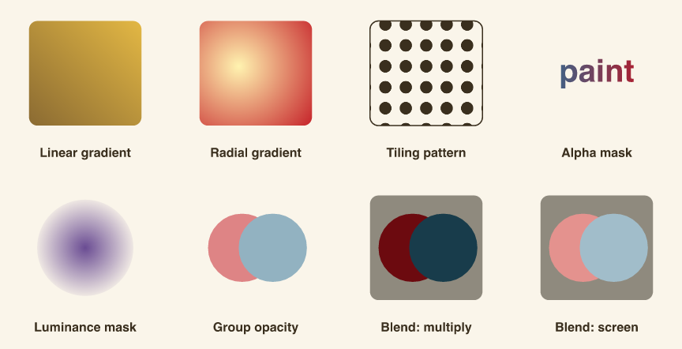

```{r}
#| include: false
suppressMessages(library(vellum))
```

Fills in **vellum** are more than flat colours. A `vl_gpar(fill = ...)` accepts
a linear or radial gradient or a tiling `vl_pattern()`, and a viewport can
composite its contents as one isolated layer through a mask, a group opacity, or
any of the CSS blend modes. None of this needs vellumplot; it is the raw paint
model the grammar draws on.

Every panel below is one swatch plus a caption, placed into a 4x2 grid layout.

```{r}
ink   <- "#3a2f1e"
paper <- "#faf5ea"

# A rounded swatch that fills a grid cell, and the caption beneath it.
swatch <- function(gp) roundrect_grob(y = 0.58, width = 0.66, height = 0.6, r = 0.05, gp = gp)
cap    <- function(txt) text_grob(txt, y = 0.12, gp = vl_gpar(fontsize = 12, fontface = "bold", col = ink))

# Two overlapping discs, reused to show how a *group* of shapes composites.
discs <- function(scene) {
  scene |>
    draw(circle_grob(x = 0.42, y = 0.58, r = 0.2, gp = vl_gpar(fill = "#c1121f", col = NA))) |>
    draw(circle_grob(x = 0.60, y = 0.58, r = 0.2, gp = vl_gpar(fill = "#2a6f97", col = NA)))
}
```

The masks are grobs in their own right. An **alpha** mask lets the fill show
through wherever the mask is opaque (here, the letterforms); a **luminance** mask
uses brightness instead, so a white-to-black radial gradient fades the layer to a
soft vignette.

```{r}
# Alpha mask: a gradient rectangle seen only through the word "paint".
alpha_mask <- as_mask(
  text_grob("paint", gp = vl_gpar(fontsize = 30, fontface = "bold", col = "white")),
  type = "alpha"
)

# Luminance mask: white shows, black hides, so the fill vignettes to nothing.
lum_mask <- as_mask(
  circle_grob(r = 0.46, gp = vl_gpar(fill = radial_gradient(c("white", "black")), col = NA)),
  type = "luminance"
)

# A dotted tile, repeated across a cell to fill a shape.
dot_tile <- circle_grob(r = 0.3, gp = vl_gpar(fill = ink, col = NA))
```

Now assemble the grid. `push()` a cell viewport, draw into it, `pop()` back out.
The mask, opacity, and blend panels push a second viewport inside the cell so the
compositing applies to that layer alone.

```{r}
grid <- grid_layout(
  widths  = vl_unit(rep(1, 4), "null"),
  heights = vl_unit(rep(1, 2), "null")
)

scene <- vl_scene(width = 9, height = 4.6, bg = paper) |>
  push(vl_viewport(layout = grid)) |>

  # Row 1
  push(vl_viewport(row = 1, col = 1)) |>
  draw(swatch(vl_gpar(fill = linear_gradient(c("#6b4f2c", "#f7c948"), x1 = 0, y1 = 0, x2 = 1, y2 = 1), col = NA))) |>
  draw(cap("Linear gradient")) |> pop() |>

  push(vl_viewport(row = 1, col = 2)) |>
  draw(swatch(vl_gpar(fill = radial_gradient(c("#fff3b0", "#c1121f"), cx = 0.4, cy = 0.62, r = 0.6), col = NA))) |>
  draw(cap("Radial gradient")) |> pop() |>

  push(vl_viewport(row = 1, col = 3)) |>
  draw(swatch(vl_gpar(fill = vl_pattern(dot_tile, width = 0.12, height = 0.12), col = ink, lwd = 1.5))) |>
  draw(cap("Tiling pattern")) |> pop() |>

  push(vl_viewport(row = 1, col = 4)) |>
  push(vl_viewport(y = 0.58, width = 0.66, height = 0.6, mask = alpha_mask)) |>
  draw(rect_grob(gp = vl_gpar(fill = linear_gradient(c("#2a6f97", "#c1121f")), col = NA))) |> pop() |>
  draw(cap("Alpha mask")) |> pop() |>

  # Row 2
  push(vl_viewport(row = 2, col = 1)) |>
  push(vl_viewport(y = 0.58, width = 0.66, height = 0.6, mask = lum_mask)) |>
  draw(rect_grob(gp = vl_gpar(fill = "#6a4c93", col = NA))) |> pop() |>
  draw(cap("Luminance mask")) |> pop() |>

  push(vl_viewport(row = 2, col = 2)) |>
  push(vl_viewport(alpha = 0.5)) |> discs() |> pop() |>
  draw(cap("Group opacity")) |> pop() |>

  # Blend modes composite onto a mid-tone swatch so both the darkening of
  # "multiply" and the lightening of "screen" stay visible.
  push(vl_viewport(row = 2, col = 3)) |>
  draw(swatch(vl_gpar(fill = "#8f8a7e", col = NA))) |>
  push(vl_viewport(blend = "multiply")) |> discs() |> pop() |>
  draw(cap("Blend: multiply")) |> pop() |>

  push(vl_viewport(row = 2, col = 4)) |>
  draw(swatch(vl_gpar(fill = "#8f8a7e", col = NA))) |>
  push(vl_viewport(blend = "screen")) |> discs() |> pop() |>
  draw(cap("Blend: screen")) |> pop() |>

  pop()
```

`render()` writes the scene to whichever format the extension names. A raster and
a vector come off the same scene graph:

```{r}
#| include: false
dir.create("figs", showWarnings = FALSE)
render(scene, "figs/paint-model.png")
render(scene, "figs/paint-model.svg")
```

{fig-alt="a four-by-two grid of swatches showing a linear gradient, radial gradient, tiling dot pattern, an alpha text mask, a luminance vignette mask, group opacity, and multiply and screen blend modes"}

[Download PNG](figs/paint-model.png){.btn .btn-primary .btn-sm download="paint-model.png"}
[Download SVG](figs/paint-model.svg){.btn .btn-primary .btn-sm download="paint-model.svg"}

Group opacity is the subtle one. Setting `alpha` on the viewport composites the
two discs as a single layer, so their overlap does *not* darken; a per-element
`vl_gpar(alpha = )` on each disc would. The blend modes (`"multiply"`, `"screen"`,
and the rest of the CSS `mix-blend-mode` set) mix that isolated layer into the
backdrop below it.

One caveat for the print path: the PDF backend has no image support yet, so a
`vl_pattern()` fill degrades to the tile's average colour there. Gradients,
masks, opacity, and blends carry through to PDF unchanged. This is the same
retained scene graph that [vellumplot](https://r-vellum.github.io/vellumplot/)
compiles into and that [vellumwidget](https://r-vellum.github.io/vellumwidget/)
reads for interactivity.
