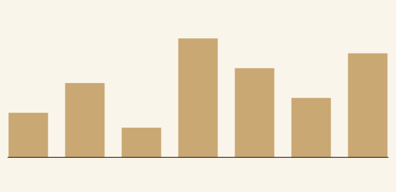
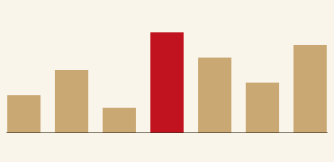

```{r}
#| include: false
suppressMessages(library(vellum))
dir.create("figs", showWarnings = FALSE)
```

A **vellum** scene is a retained graph: every grob and viewport stays addressable
after you draw it. Give a node a `name` and you can find it again, read its
properties, and rewrite them, leaving the rest of the scene untouched. `grid` can
do this too, with `grid.ls()`, `getGrob()` and `editGrob()`; here the tree is a
value rather than device state, and the same addressability is what `hit_test()`
and `scene_model()` read geometry back through.

Here is a plain bar chart built from named `rect_grob`s. Each bar carries a
`name` (`bar1`, `bar2`, ...) alongside its geometry and fill.

```{r}
ink <- "#3a2f1e"; paper <- "#faf5ea"; base <- "#c9a874"; hi <- "#c1121f"
vals <- c(3, 5, 2, 8, 6, 4, 7)
n <- length(vals)
y0 <- 0.18   # baseline

scene <- vl_scene(width = 7, height = 3.4, bg = paper)
for (i in seq_len(n)) {
  h <- 0.62 * vals[i] / max(vals)
  scene <- scene |>
    draw(rect_grob(
      x = (i - 0.5) / n, y = y0 + h / 2, width = 0.7 / n, height = h,
      name = paste0("bar", i),
      gp = vl_gpar(fill = base, col = NA)
    ))
}
scene <- scene |>
  draw(segments_grob(x0 = 0.02, y0 = y0, x1 = 0.98, y1 = y0,
                     gp = vl_gpar(col = ink, lwd = 1.5)))
```

## Inspecting the graph

`node_names()` lists what is addressable, and `get_node()` hands back a single
node so you can read its current state.

```{r}
node_names(scene)

get_node(scene, "bar4")@gp@fill
```

## Editing a node

`edit_node()` sets properties on the named node and returns a *new* scene; the
original is left as it was (copy-on-modify). To highlight the tallest bar, find
its name and rewrite only that node's fill. No loop over the others, no rebuild.

```{r}
top <- paste0("bar", which.max(vals))

highlighted <- edit_node(scene, top, gp = vl_gpar(fill = hi, col = NA))
```

```{r}
#| include: false
render(scene, "figs/retained-editing-before.png")
render(highlighted, "figs/retained-editing-after.png")
# Card image is the edited scene.
render(highlighted, "figs/retained-editing.png")
```

::: {layout-ncol=2}
{fig-alt="a bar chart of seven tan bars on a parchment background"}

{fig-alt="the same bar chart with the tallest bar recoloured red"}
:::

`scene` still shows every bar in the base colour, because `edit_node()` never
mutated it. That copy-on-modify guarantee is what makes a scene safe to pass
around: derive as many variants as you like from one base graph and none of them
disturb the others.

The same retained graph is what [vellumplot](https://r-vellum.github.io/vellumplot/)
compiles a plot into, and what [vellumwidget](https://r-vellum.github.io/vellumwidget/)
walks to attach per-element keys for interactivity. Naming a node is the seam
between describing a scene and editing one after the fact.
