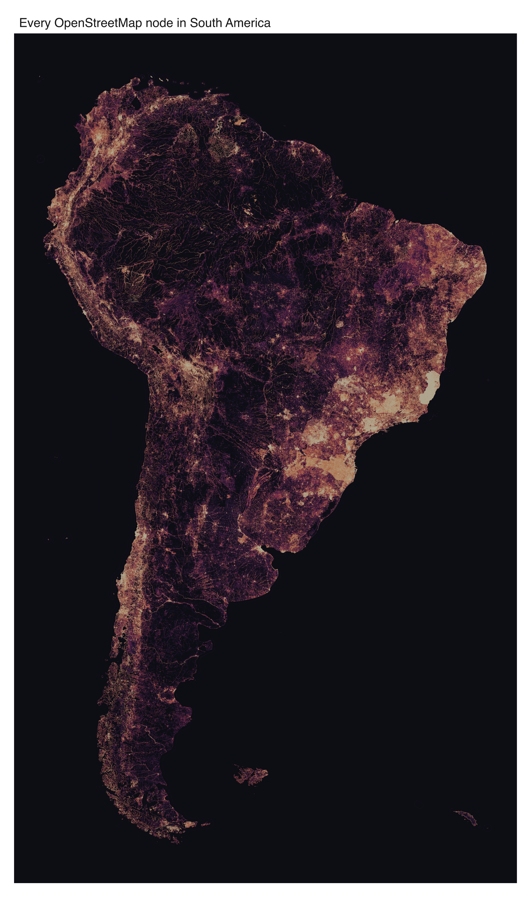

This is every node in the South America OpenStreetMap extract, all
**632 million**, down to the untagged vertices behind roads, rivers, power
lines and building outlines. Drawing all of them traces the continent's
geometry: the braided rivers of the Amazon, the São Paulo–Rio corridor bright
along the east coast, the Chilean coast running thin down to Tierra del Fuego.

::: {.callout-note}
This example is **not run** when the site is built. It reads a multi-GB
`.osm.pbf` from disk and needs the `duckdb` and `DBI` packages. The image below
is the real output, committed with the site; the script at the bottom is the
exact source. Grab the input from
[Geofabrik](https://download.geofabrik.de/south-america.html).
:::

## The downsample trick

Handing 632 million points to an in-memory plotting pipeline means holding them
in memory first. `mark_datashade()` aggregates inside R, so every node has to
land in an R data frame before anything is drawn, and 632M rows plus the copy R
makes to slice them need far more RAM than the machine this ran on had. R stops
with a `vector memory limit reached` error. That ceiling is the hardware, not
vellumplot: on a machine with enough memory the same call would draw all 632M
directly.

You can sidestep it by looking at what datashading is: a 2D histogram, then a
density-to-colour map. Any two points that fall in the same output pixel are
identical in the finished image, so there is no reason to move 632 million rows
into R when the picture is a few thousand pixels wide. Do the histogram in
DuckDB instead: snap each node to a cell of the output grid, `GROUP BY` the
cell, `COUNT`. Only the non-empty cells come back.

| | count |
|---|--:|
| nodes streamed from the PBF | 632,393,976 |
| non-empty cells returned to R | 8,370,415 |

That is a 76× cut, and it costs nothing in the render. Binning to the output
grid is what `mark_datashade()` does internally anyway; this just moves it
upstream, where DuckDB streams the file from disk and spills to disk when it has
to. R holds only the 8.4M cells, colours them, and draws them with
`mark_tile()`. The result is the same image the in-memory path would have
produced, on a machine that could never have held the points.

## The map

The grid is 5000 cells wide. `eq_hist` (histogram equalisation) stretches the
count range across the ramp, so the near-empty interior of the Amazon and the
dense coast both stay legible in one frame.

{fig-alt="Datashaded map of all 632 million OpenStreetMap nodes in mainland South America, tracing rivers, roads and cities on a dark ground"}

## The script

```r
# Every OpenStreetMap node in South America (~632 million points), datashaded.
#
# Streams a multi-GB .osm.pbf with DuckDB's spatial extension, aggregates every
# node into a pixel grid IN DUCKDB, and draws the grid with vellumplot. The
# aggregation is the trick: 632M points collapse to ~8.4M non-empty cells, so R
# never has to hold the raw point cloud.
#
# REQUIREMENTS (none are vellumplot dependencies -- this is a heavy showcase):
#   * packages `duckdb`, `DBI`
#   * a South America .osm.pbf from
#     https://download.geofabrik.de/south-america.html

library(DBI)
library(duckdb)
library(vellumplot)

pbf <- path.expand("~/Downloads/south-america-latest.osm.pbf")
outdir <- "figures"
dir.create(outdir, showWarnings = FALSE)
parquet <- file.path(outdir, "south-america-nodes.parquet")

# Mainland frame (lon/lat). Chile's Easter Island (~109 W) and Ecuador's
# Galapagos (~91 W) sit far out in the Pacific; left in they blow the bounding
# box westward and leave the mainland tiny in a field of black. This drops them.
crop <- list(lon = c(-82, -34), lat = c(-56, 13))
gw <- 5000L # output grid width in cells

# --- 1. Extract every node -> Parquet (once) -------------------------------
# ST_ReadOSM() streams the PBF element by element. We keep every node -- tagged
# or not -- and project to Web Mercator in SQL (lat clamped to the valid band).
if (!file.exists(parquet)) {
  con <- dbConnect(duckdb())
  dbExecute(con, "INSTALL spatial; LOAD spatial;")
  dbExecute(con, "SET threads TO 4; SET memory_limit = '12GB';")
  dbExecute(con, sprintf(
    "
    COPY (
      SELECT
        lon * 20037508.34 / 180.0 AS x,
        ln(tan((90.0 + least(85.05, greatest(-85.05, lat))) * pi() / 360.0))
          / (pi() / 180.0) * 20037508.34 / 180.0 AS y
      FROM ST_ReadOSM('%s')
      WHERE kind = 'node' AND lat IS NOT NULL AND lon IS NOT NULL
    ) TO '%s' (FORMAT parquet, COMPRESSION zstd)
  ",
    pbf, parquet
  ))
  dbDisconnect(con, shutdown = TRUE)
}

# --- 2. The downsample trick: aggregate to the grid IN DUCKDB --------------
# Datashading is a 2D histogram + a density-to-colour map, so we do the
# histogram in SQL: snap each node to a cell of the output grid and COUNT. Only
# the non-empty cells (~8.4M of 632M points) come back to R. The parentheses
# around every %.10g matter -- the bounds are negative here, and "x - -1.5e7"
# would splice into "x --1.5e7" where SQL's "--" begins a comment.
con <- dbConnect(duckdb())
dbExecute(con, "SET threads TO 4; SET memory_limit = '12GB';")

mx <- crop$lon * 20037508.34 / 180
my <- log(tan((90 + crop$lat) * pi / 360)) / (pi / 180) * 20037508.34 / 180
where <- sprintf(
  "WHERE x BETWEEN %.10g AND %.10g AND y BETWEEN %.10g AND %.10g",
  mx[1], mx[2], my[1], my[2]
)

b <- dbGetQuery(con, sprintf(
  "SELECT min(x) x0, max(x) x1, min(y) y0, max(y) y1
   FROM read_parquet('%s') %s",
  parquet, where
))
asp <- (b$y1 - b$y0) / (b$x1 - b$x0) # equal-aspect (already projected)
gh <- as.integer(gw * asp)

grid <- dbGetQuery(con, sprintf(
  "SELECT
     least(%d, greatest(0, floor((x - (%.10g)) / ((%.10g) - (%.10g)) * %d)::INT)) AS cx,
     least(%d, greatest(0, floor((y - (%.10g)) / ((%.10g) - (%.10g)) * %d)::INT)) AS cy,
     count(*) AS n
   FROM read_parquet('%s') %s
   GROUP BY 1, 2",
  gw - 1L, b$x0, b$x1, b$x0, gw,
  gh - 1L, b$y0, b$y1, b$y0, gh, parquet, where
))
dbDisconnect(con, shutdown = TRUE)
message(format(nrow(grid), big.mark = ","), " non-empty cells")

# --- 3. Colour (eq_hist) + draw the grid -----------------------------------
# eq_hist (histogram equalisation, datashader's default) is the rank/CDF of the
# cell counts; it spreads the huge dynamic range across the ramp. We colour each
# cell in R and let mark_tile() draw it; scale_fill_identity() passes the hex
# through untouched.
ramp <- c("#0d0d14", "#3b1f5e", "#b0246a", "#ff8c42", "#fff2cc")
eq <- rank(grid$n, ties.method = "average") / nrow(grid)
grid$fill <- grDevices::rgb(grDevices::colorRamp(ramp)(eq), maxColorValue = 255)

vplot(grid, width = 14 / asp, height = 14, dpi = 300) |>
  mark_tile(x = cx, y = cy, fill = fill) |>
  scale_fill_identity() |>
  coord_fixed() |>
  theme_void() |>
  set_theme(panel_bg = ramp[1]) |>
  labs(title = "Every OpenStreetMap node in South America") |>
  render_plot(file.path(outdir, "south-america-nodes-density.png"))
```
