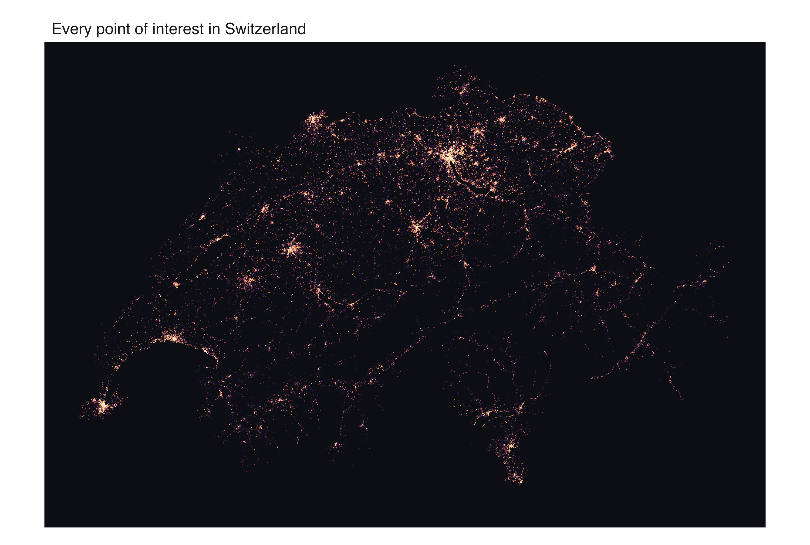
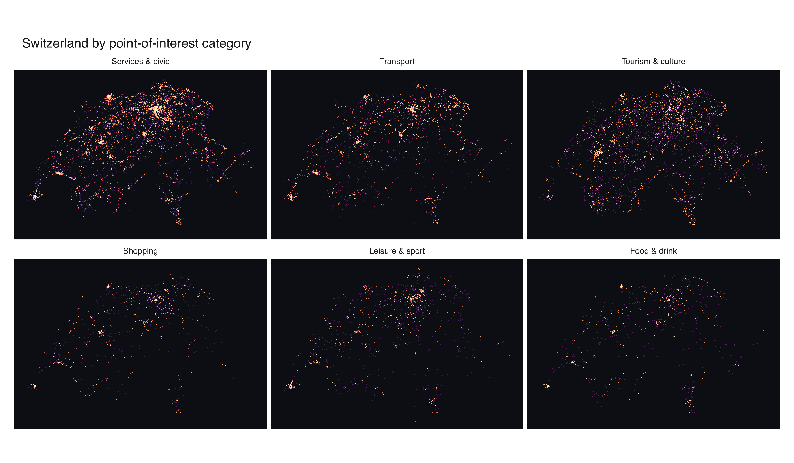

No basemap, no border, no coastline file. Every bright pixel here is a tagged
point in OpenStreetMap — a restaurant, a bus stop, a bench, a viewpoint. Plot
half a million of them and Switzerland draws itself: the cities glow, the lakes
punch dark holes, and the Alpine valleys thin out to single threads of road.

::: {.callout-note}
This example is **not run** when the site is built. It reads a ~500 MB
`.osm.pbf` extract from disk and needs the `duckdb`, `DBI`, and `arrow`
packages. The images below are the real output, rendered once and committed
with the site; the script at the bottom is the exact source. Grab the input
from [Geofabrik](https://download.geofabrik.de/europe/switzerland.html)
(`switzerland-latest.osm.pbf`).
:::

## Reading the POIs

The raw PBF holds tens of millions of nodes, ways, and relations. We never load
that into R. DuckDB's `spatial` extension has `ST_ReadOSM()`, which streams the
file element by element, so the filtering and the Web Mercator projection both
happen in SQL — R only ever sees the ~528,000 rows that survive. On a laptop the
whole extraction takes a couple of seconds.

A point of interest, for this map, is any node carrying an `amenity`, `shop`,
`tourism`, `leisure`, or `public_transport` tag. Each one is bucketed into a
category from those tags in the same pass.

## The map

`mark_datashade()` aggregates the points into a pixel grid and shades each cell
by density. `how = "eq_hist"` (histogram equalisation) spreads the enormous
dynamic range — a bench-lined city block versus an empty pass — across the whole
colour ramp, so both stay legible instead of the cities blowing out to white.

{fig-alt="Datashaded density map of ~528,000 OpenStreetMap points of interest tracing the shape of Switzerland, cities glowing on a dark ground"}

## One geography per category

Split the same data by category with `facet_wrap()` and each POI type turns out
to live somewhere different. Transport follows the rail and road network as thin
connected lines. Tourism scatters up into the Alps where the viewpoints and huts
are. Shopping, food, and leisure collapse back onto the big cities. Services and
civic furniture — benches, bins, post boxes — is the densest and the most evenly
spread, which is why it traces the country most completely.

{fig-alt="Six small-multiple datashaded maps of Switzerland, one per POI category, each showing a distinct spatial distribution"}

## The script

```r
# Every point of interest in Switzerland, from an OpenStreetMap extract.
#
# Streams a ~500 MB .osm.pbf with DuckDB's spatial extension, keeps only tagged
# POI nodes, projects them to Web Mercator in SQL, and datashades the ~528k
# survivors with vellumplot -- once as a density map, once faceted by category.
#
# REQUIREMENTS (none are vellumplot dependencies -- this is a heavy showcase):
#   * packages `duckdb`, `DBI`, `arrow`
#   * a Switzerland .osm.pbf, e.g. from
#     https://download.geofabrik.de/europe/switzerland.html

library(DBI)
library(duckdb)
library(arrow)
library(vellumplot)

pbf <- path.expand("~/Downloads/switzerland-latest.osm.pbf")  # <- your file
outdir <- "figures"
dir.create(outdir, showWarnings = FALSE)

# --- 1. Extract POIs with DuckDB -------------------------------------------
# ST_ReadOSM() streams the PBF; all the filtering, categorising, and the
# Web Mercator projection happen in SQL so R only sees the surviving rows.
con <- dbConnect(duckdb())
dbExecute(con, "INSTALL spatial; LOAD spatial;")
dbExecute(con, "SET threads TO 4;")

category_case <- "
  CASE
    WHEN tags['amenity'] IN ('restaurant','cafe','bar','pub','fast_food',
         'biergarten','food_court','ice_cream') THEN 'Food & drink'
    WHEN tags['shop'] IS NOT NULL THEN 'Shopping'
    WHEN tags['tourism'] IS NOT NULL
         OR tags['amenity'] IN ('theatre','cinema','arts_centre','nightclub')
         THEN 'Tourism & culture'
    WHEN tags['public_transport'] IS NOT NULL
         OR tags['amenity'] IN ('parking','bicycle_parking','fuel',
         'charging_station','bicycle_rental','car_sharing','taxi',
         'bus_station','parking_entrance') THEN 'Transport'
    WHEN tags['leisure'] IS NOT NULL
         OR tags['amenity'] = 'fitness_centre' THEN 'Leisure & sport'
    ELSE 'Services & civic'
  END"

query <- sprintf("
  SELECT
    lon * 20037508.34 / 180.0 AS x,                              -- Web Mercator
    ln(tan((90.0 + lat) * pi() / 360.0)) / (pi() / 180.0)
      * 20037508.34 / 180.0 AS y,
    %s AS category
  FROM ST_ReadOSM('%s')
  WHERE kind = 'node'
    AND (tags['amenity'] IS NOT NULL OR tags['shop'] IS NOT NULL
         OR tags['tourism'] IS NOT NULL OR tags['leisure'] IS NOT NULL
         OR tags['public_transport'] IS NOT NULL)
    AND lat IS NOT NULL AND lon IS NOT NULL
", category_case, pbf)

poi <- dbGetQuery(con, query)
dbDisconnect(con, shutdown = TRUE)
message("Loaded ", format(nrow(poi), big.mark = ","), " POIs")

# --- 2. Shared setup -------------------------------------------------------
xr <- range(poi$x); yr <- range(poi$y)
asp <- diff(yr) / diff(xr)                    # equal-aspect (already projected)
ramp <- c("#0d0d14", "#3b1f5e", "#b0246a", "#ff8c42", "#fff2cc")
levels_by_count <- c("Services & civic", "Transport", "Tourism & culture",
                     "Shopping", "Leisure & sport", "Food & drink")
poi$category <- factor(poi$category, levels = levels_by_count)

# --- 3. Density map --------------------------------------------------------
# gw is the datashade grid resolution -- it, not dpi, sets how much detail the
# map holds. Size the page (width * dpi) so the panel is at least gw wide and
# the raster draws close to 1:1 instead of upscaling.
gw <- 2800L
gh <- as.integer(gw * asp)
vplot(poi, width = 10, height = 10 * asp, dpi = 300) |>
  mark_datashade(x = x, y = y, width = gw, height = gh,
                 colors = ramp, how = "eq_hist") |>
  coord_fixed() |>
  theme_void() |>
  set_theme(panel_bg = "#0d0d14") |>
  labs(title = "Every point of interest in Switzerland") |>
  render_plot(file.path(outdir, "swiss-poi-density.png"))

# --- 4. Faceted by category ------------------------------------------------
fgw <- 1200L
fgh <- as.integer(fgw * asp)
vplot(poi, width = 12, height = 7, dpi = 300) |>
  mark_datashade(x = x, y = y, width = fgw, height = fgh,
                 colors = ramp, how = "eq_hist") |>
  facet_wrap(~category) |>
  coord_fixed() |>
  theme_void() |>
  set_theme(panel_bg = "#0d0d14") |>
  labs(title = "Switzerland by point-of-interest category") |>
  render_plot(file.path(outdir, "swiss-poi-category.png"))

message("Wrote 2 figures to ", outdir)
```
