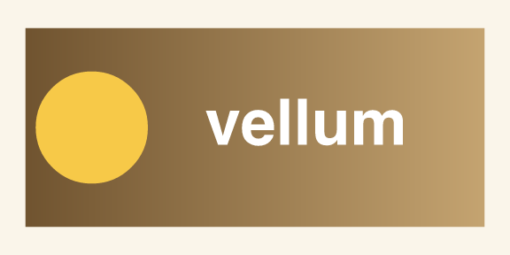
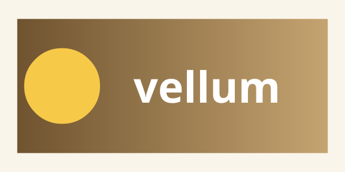

```{r}
#| include: false
suppressMessages(library(vellum))
```

This is the layer beneath the grammar. A **vellum** scene is described once with
low-level grobs, then compiled and rendered by the Rust backend. The *same*
scene renders to a raster (PNG), a vector (SVG), or a print-ready document (PDF)
with consistent geometry and text shaping — no per-format fiddling.

```{r}
scene <- vl_scene(width = 6, height = 3, bg = "#faf5ea") |>
  draw(rect_grob(
    width = 0.9, height = 0.78,
    gp = vl_gpar(fill = linear_gradient(c("#6b4f2c", "#c9a874")), col = NA)
  )) |>
  draw(circle_grob(
    x = 0.18, y = 0.5, r = 0.22,
    gp = vl_gpar(fill = "#f7c948", col = NA)
  )) |>
  draw(text_grob(
    "vellum", x = 0.60, y = 0.5,
    gp = vl_gpar(fontsize = 54, col = "white", fontface = "bold")
  ))
```

One scene value, three calls to `render()` — the output format follows the file
extension:

```{r}
#| eval: false
render(scene, "vellum-logo.png")   # raster  — tiny-skia
render(scene, "vellum-logo.svg")   # vector  — hand-rolled SVG writer
render(scene, "vellum-logo.pdf")   # print   — krilla
```

```{r}
#| include: false
dir.create("figs", showWarnings = FALSE)
for (ext in c("png", "svg", "pdf")) {
  render(scene, file.path("figs", paste0("three-formats.", ext)))
}
```

::: {layout-ncol=2}
{fig-alt="vellum logo scene rendered as a raster PNG"}

{fig-alt="the same vellum logo scene rendered as vector SVG"}
:::

Pixel-for-pixel the raster and the vector agree, because both come from one
scene graph and one layout solve. Grab any of the three:

[Download PNG](figs/three-formats.png){.btn .btn-primary .btn-sm download="vellum-logo.png"}
[Download SVG](figs/three-formats.svg){.btn .btn-primary .btn-sm download="vellum-logo.svg"}
[Download PDF](figs/three-formats.pdf){.btn .btn-primary .btn-sm download="vellum-logo.pdf"}

Because rendering is deterministic, the bytes are stable across platforms — which
is what makes vellum graphics snapshot-testable. This retained scene graph is
also what [vellumplot](https://r-vellum.github.io/vellumplot/) compiles into, and
what [vellumwidget](https://r-vellum.github.io/vellumwidget/) reads to wire up
interactivity.
