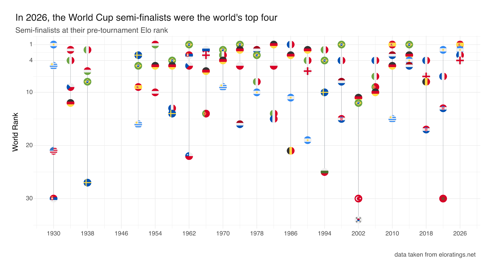

`mark_image()` draws a raster image at each `(x, y)` position instead of a point
or a symbol. You map `src` to a column of file paths, set a `size` (the image
height, in millimetres; the width follows from the image's aspect ratio), and
every row becomes a little picture on the panel. It is the natural mark when the
category *is* the picture: logos, faces, icons, or, here, national flags.

The data is every World Cup semi-finalist from 1930 to 2026, placed at the
**world Elo rank** it held on the eve of the tournament (rank 1 at the top).
Each team is drawn as a round flag; a thin grey connector spans each
tournament's best- to worst-ranked semi-finalist. The story reads off the top of
the chart: 2026 is the only edition where all four flags sit in the top four.
The semi-finalists *were* the world's four best teams going in.

::: {.callout-note}
This example is **not run** when the site is built: it needs 25 round flag PNGs
that are not committed to the repository. The image below is the real output,
committed with the site; the code at the end is the exact source. See
*Getting the round flags* for where to fetch them.
:::

{fig-alt="Chart with tournament year on the x-axis and world rank (1 at top) on the y-axis. Round national flags mark each semi-finalist, connected by a thin grey line per tournament. Most years have flags trailing down into the teens and twenties; 2026's four flags cluster at ranks one to four."}

## Getting the round flags

The circular flags come from the [circle-flags](https://github.com/HatScripts/circle-flags)
project (MIT-licensed). They are SVGs, one per country, served over jsDelivr:

```
https://cdn.jsdelivr.net/gh/HatScripts/circle-flags/flags/<iso2>.svg
```

where `<iso2>` is the lowercased ISO 3166-1 alpha-2 code (`es`, `br`, `fr`, …).
The example expects a **PNG** per team, named by the code used in the data and
placed in a `flags/` folder next to the document, e.g. `flags/ES.png`,
`flags/BR.png`. Those codes are the uppercased alpha-2 codes, with one
exception: **England is `gb-eng`** (there is no ISO country for it).

Rasterise with a mask-aware SVG renderer so the circular clip is honoured.
[librsvg](https://gitlab.gnome.org/GNOME/librsvg)'s `rsvg-convert` or the R
[`rsvg`](https://cran.r-project.org/package=rsvg) package both work:

```
rsvg-convert -w 200 -h 200 es.svg -o flags/ES.png
```

ImageMagick's built-in SVG reader ignores the mask and renders the flags as
squares, so avoid it for this.

## The code

```{r}
#| eval: false
#| code-fold: true
#| code-summary: "The data: 92 semi-finalists (year, pre-tournament world rank, team code)"
sf <- read.csv(text = "world_cup,world_rank,code
1930,1,AR
1930,5,UY
1930,21,US
1930,30,RS
1934,2,AT
1934,4,IT
1934,9,CZ
1934,12,DE
1938,2,IT
1938,6,HU
1938,8,BR
1938,27,SE
1950,3,SE
1950,5,BR
1950,9,ES
1950,16,UY
1954,1,HU
1954,5,DE
1954,10,UY
1954,10,AT
1958,4,BR
1958,5,DE
1958,13,FR
1958,14,SE
1962,1,BR
1962,3,RS
1962,5,CZ
1962,22,CL
1966,2,RU
1966,3,EN
1966,6,DE
1966,14,PT
1970,2,BR
1970,3,IT
1970,4,DE
1970,9,UY
1974,1,BR
1974,2,DE
1974,5,PL
1974,16,NL
1978,2,NL
1978,3,BR
1978,8,IT
1978,10,AR
1982,1,DE
1982,5,PL
1982,14,IT
1982,15,FR
1986,1,FR
1986,3,DE
1986,11,AR
1986,21,BE
1990,2,DE
1990,4,IT
1990,6,EN
1990,19,AR
1994,2,IT
1994,4,BR
1994,10,SE
1994,25,BG
1998,1,BR
1998,4,FR
1998,8,NL
1998,15,HR
2002,11,DE
2002,12,BR
2002,30,TR
2002,34,KR
2006,4,FR
2006,7,IT
2006,9,PT
2006,10,DE
2010,1,ES
2010,3,NL
2010,5,DE
2010,15,UY
2014,1,BR
2014,3,DE
2014,4,AR
2014,5,NL
2018,4,FR
2018,7,EN
2018,8,BE
2018,17,HR
2022,2,AR
2022,7,FR
2022,13,HR
2022,30,MA
2026,1,ES
2026,2,AR
2026,3,FR
2026,4,EN")
```

```{r}
#| eval: false
library(vellumplot)

# round flag PNG for each team (see "Getting the round flags" above)
sf$flag <- file.path("flags", paste0(sf$code, ".png"))

# one vertical connector per tournament: best-ranked to worst-ranked semi-finalist
span <- do.call(rbind, lapply(split(sf, sf$world_cup), function(d) {
  data.frame(year = d$world_cup[1], best = min(d$world_rank), worst = max(d$world_rank))
}))

vplot(sf, width = 10, height = 5.5, dpi = 300) |>
  mark_segment(
    x = year, xend = year, y = best, yend = worst, data = span,
    color = "#9aa0a6", linewidth = 0.6, alpha = 0.9
  ) |>
  mark_image(x = world_cup, y = world_rank, src = flag, size = 4) |>
  scale_y_continuous(trans = "reverse", breaks = c(1, 4, 10, 20, 30), name = "World Rank") |>
  scale_x_continuous(breaks = seq(1930, 2026, by = 8), name = "") |>
  theme_minimal() |>
  theme(legend.position = "none") |>
  labs(
    title = "In 2026, the World Cup semi-finalists were the world's top four",
    subtitle = "Semi-finalists at their pre-tournament Elo rank",
    caption = "data: eloratings.net"
  ) |>
  render_plot("worldcup-flags.png")
```
