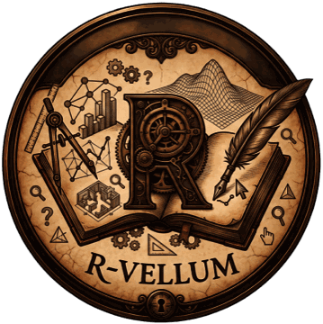
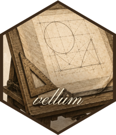
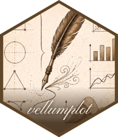
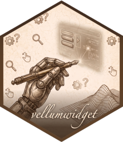
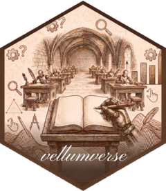

::::{.vellum-hero}
{.logo fig-alt="R-vellum emblem: a compass, gears, plots, and a quill on parchment"}

# vellum gallery

::::{.tagline}
The parchment, the pen, and the annotation revealed on the page.
::::

A showcase of what you can draw with the **vellum** graphics ecosystem in R.
Its engine measures text and solves layout before anything reaches a canvas,
so a figure is a thing you can interrogate, lint, hash, and hand to a browser
— not just pixels. The grammar sits on top; the widget reads the same solved
scene.

[Browse the gallery](gallery/index.qmd){.btn .btn-primary .btn-lg}
::::

## The ecosystem

::::{.eco-grid}

:::{.eco-card}
[{fig-alt="vellum hex logo"}](https://r-vellum.github.io/vellum/)

### vellum

[the parchment]{.role}

A low-level graphics framework in the spirit of grid. Text is measured and
layout solved with no device open, so the scene can say where every element
landed before it is drawn.
:::

:::{.eco-card}
[{fig-alt="vellumplot hex logo"}](https://r-vellum.github.io/vellumplot/)

### vellumplot

[the pen]{.role}

A declarative, pipe-first grammar of graphics. A plot is an inspectable,
serializable spec until it compiles into a vellum scene.
:::

:::{.eco-card}
[{fig-alt="vellumwidget hex logo"}](https://r-vellum.github.io/vellumwidget/)

### vellumwidget

[the annotation]{.role}

Hosts a vellum scene in the browser — hover, select, brush, zoom — reading the
solved geometry instead of re-drawing the plot in a second engine.
:::

:::{.eco-card}
[{fig-alt="vellumverse hex logo"}](https://r-vellum.github.io/vellumverse/)

### vellumverse

[the meta-package]{.role}

Installs and loads the whole ecosystem together, in the spirit of the
tidyverse.
:::

::::

## A taste

A data frame, a few marks, and a trained scale make a whole plot.

```{r}
#| include: false
library(vellumplot)
# Render a plot spec to a PNG and embed it. Using render_plot() (rather than
# knitr's auto-print) keeps rendering off the knitr graphics device, whose
# integer dpi the vellum backend rejects.
vg <- function(p, name, dpi = 150) {
  dir.create("figs", showWarnings = FALSE)
  f <- file.path("figs", paste0(name, ".png"))
  render_plot(p, f, dpi = dpi)
  knitr::include_graphics(f)
}
```

```{r}
p <- vplot(mtcars, width = 7, height = 4.2) |>
  mark_point(x = wt, y = mpg, color = hp, size = 2.4) |>
  mark_smooth(x = wt, y = mpg, method = "lm", se = TRUE) |>
  scale_color_continuous() |>
  labs(
    title = "Weight vs. fuel economy",
    x = "weight (1000 lbs)", y = "miles per gallon", color = "hp"
  ) |>
  theme_minimal()
```

```{r}
#| echo: false
vg(p, "home-taste")
```

See the rest in the [gallery](gallery/index.qmd).
